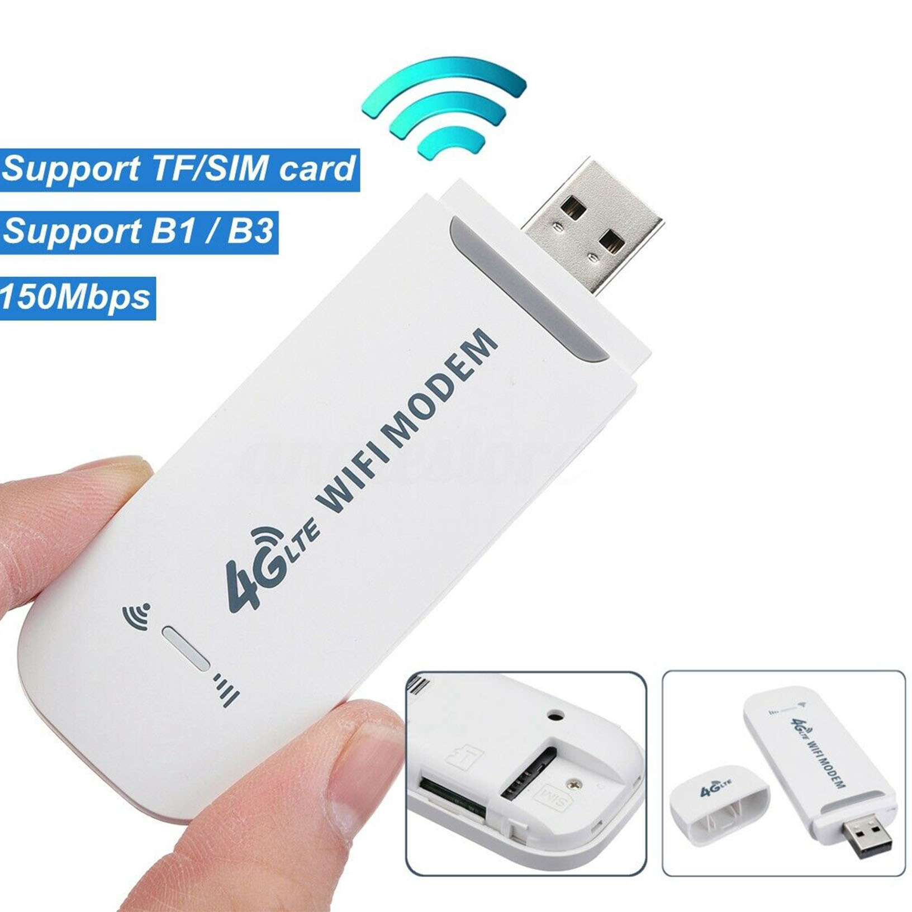

# dongle-lte-api

API For Dongle LAN/WAN LTE USB Modems, you can use this to simply get information about your internet usage, signal, and tons of other stuff
## Tested on:
* Dongle LTE WIFi Modems:
    <div style="width: 30%; height: 30%">

   
    </div> 


## Install
```shell
pip3 install git+https://github.com/bxdoan/dongle-lte-api.git
```

## Usage

```python3
from dongle_tle_api import Dongle
from dongle_tle_api.enums import FieldsQuery

client = Dongle()
info = client.get_data()
print(info)
device_list = client.get_data(fields=FieldsQuery.DeviceList)
print(device_list)
```
Result dict
```python
{
   "ssidName":"DonHandsome",
   "signalStrength":-74,
   "sn":"1000000051E834",
   "simCardState":"valid",
   "systemVersion":"UFI103_V02_ZX_DD_230306",
   "appVersion":"WEB_V1.0.311#",
   "imei":"861323063168235",
   "basebandVersion":"UFI103_CT 20220801",
   "mac":"5c:a0:00:7b:05:3f",
   "wanIpAddress":"10.188.47.213",
   "imsi":"452021123670828",
   "iccId":"89840200011236708283",
   "hardwareVersion":"HW1.3"
}
{
   "deviceList":[
      {
         "deviceIp":"192.168.100.248",
         "deviceName":"Buis-MBP",
         "deviceType":"WIFI",
         "deviceAddress":"f8:4d:89:98:07:76",
         "deviceState":1
      }
   ]
}
```

Reboot network
```python3
from dongle_tle_api import Dongle

Dongle().reboot()
```

Change SSID
```python3
from dongle_tle_api import Dongle
Dongle().change_ssid(ssid="Don123")
```

Change password
```python3
from dongle_tle_api import Dongle
Dongle().change_password(password="12344321")
```

NOTE : change password/change ssid/reboot action will automate restart the modems
## Contact

[](https://t.me/bxdoan)
[](https://twitter.com/bxdoan)
[](mailto:hi@bxdoan.com)

## Thanks for use
Buy me a coffee

[](https://www.buymeacoffee.com/bxdoan)
[](https://etherscan.io/address/0x610322AeF748238C52E920a15Dd9A8845C9c0318)
[](https://paypal.me/bxdoan)
